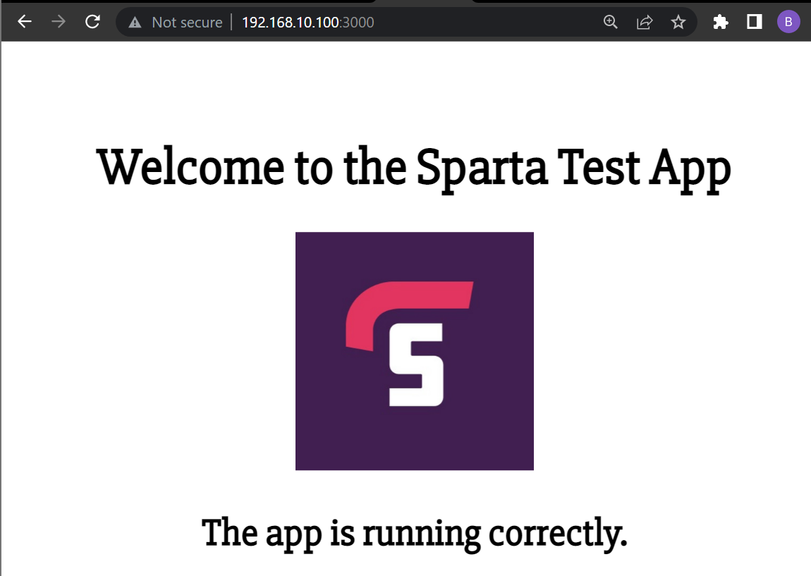

# App Deployment

This guide will explain how to deploy a web app on an nginx web server hosted on our Vagrant VM.

Pre-requisites:

- Understand how to create and run an nginx web server using Vagrant: [tech230-vagrant-intro](https://github.com/bradley-woods/tech230-vagrant-intro)
- Have your application to be deployed in a folder called 'app' in the same directory as your 'Vagrantfile':

    

## Updating the Vagrantfile

1. Following on from the previous repository, which explained how to create a VM and deploy an nginx web server on it, we need to first update the 'Vagrantfile' by adding a new line `config.vm.synced_folder "app", "/home/vagrant/app"` shown below:

    ```ruby
    Vagrant.configure("2") do |config|
    
      # configure the VM settings
      config.vm.box = "ubuntu/xenial64"
      config.vm.network "private_network", ip:"192.168.10.100"

      # provision the VM to have nginx web server
      config.vm.provision "shell", path: "provision.sh"

      # move app folder from local machine to the VM
      config.vm.synced_folder "app", "/home/vagrant/app"

    end
    ```

    > **Note:** the first argument "app" is to specify the app folder that will be synced with the "/home/vagrant/app" directory in the VM, where "/" at the start of the filepath indicates user and not root directory.

2. Let's start up our VM using the following command ensuring we are in the correct directory:

    ```console
    $ vagrant up
    ```

## Installing App Dependencies

1. At this point, we should have a provisioned VM running an nginx web server containing our syncronised app folder. To check this, `vagrant ssh` into the VM on a Git bash terminal and enter `cd app` followed by `pwd` to print the working directory. The following should appear if the VM was installed and syncronised correctly.

    

2. The next step is to install a list of app dependencies (packages that our app need to work properly) using the following commands. In summary, this installs the required software and tools necessary to run the app on the VM, such as nodeJS, process manager and Python software properties.

    ```console
    $ sudo apt-get install nodejs -y

    $ sudo apt-get install python-software-properties

    $ curl -sL https://deb.nodesource.com/setup_6.x | sudo -E bash -

    $ sudo apt-get install nodejs -y

    $ sudo npm install pm2 -g
    ```

    > **Note:** The curl command retrieves and downloads a package from the provided url. Also, the second `install nodejs` command is to get the correct version from the curl command.

3. Now, navigate to the app folder if you wasn't already inside it, using `cd app` and run the following command to install any necessary node modules the developers say we need to run the app:

    ```
    app$ npm install
    ```

    > **Note:** `app$` indicates you are in the correct 'app' folder.

## Running the App

1. The final step is simple, we just need to run the following command to start our app, which displays the following information in terminal to tell us which port the app is running:

    ```
    app$ node app.js
    ```

    

2. Now, if we go to our browser address bar and type the IP address followed by the port number (192.168.10.100:3000) we are presented with our web app successfully deployed on our VM!

    
